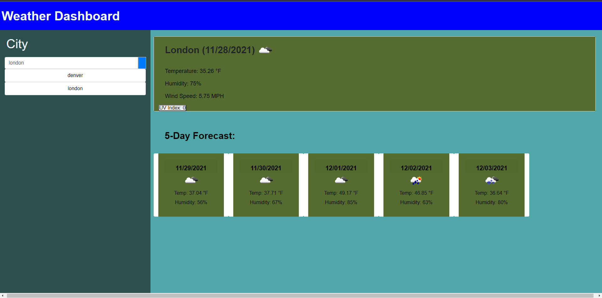

# weather-dashboard

##Screenshot

###Description

> This is a functioning weather dashboard allowing for a 5 day forecast, along with the current, of the correspondingly search city within the left search bar.
> This contains the temperature, humidity and windspind of the given area.
> After searching, the city name is then remembered within local storage and displayed underneath the search bar for easy user access on click of said remembered city.<>

1. Links -https://wwbarton.github.io/weather-dashboard/
